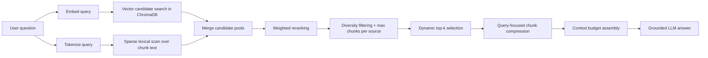

# Mermaid

> A dual-service research copilot for PDFs and web pages, powered by Django auth, FastAPI ingestion, and a recommender-style retrieval engine on top of per-user ChromaDB stores.

Mermaid lets each signed-in user upload research material, index it once, and ask grounded questions without sending whole documents to the LLM.

## Single Ultimate Flow

```mermaid
flowchart LR
    U["User"] --> B["Browser UI"]
    B --> D["Django auth + workspace"]
    D -->|Upload PDFs or URLs| S["Disk staging + upload limits"]
    S --> F["FastAPI ingest service"]
    F --> P["Extract text, chunk, embed"]
    P --> C["Per-user ChromaDB index"]
    U --> Q["Ask a question"]
    Q --> R["Hybrid retrieval + reranking"]
    R --> K["Context compression + budget"]
    K --> L["Grounded LLM prompt"]
    L --> A["Answer + retrieval stats"]
    A --> B
    D --> X["Logout"]
    X --> Z["FastAPI session cleanup"]
    Z --> C
```



## What Mermaid Does

- Handles login, signup, logout, and the workspace UI through Django
- Accepts PDFs and URLs, then stores them per user through FastAPI
- Splits documents into chunks, creates embeddings, and writes them to ChromaDB
- Uses a recommender-style hybrid retrieval and reranking pipeline so only the best context reaches the LLM
- Returns grounded answers with retrieval metadata instead of raw model guesses
- Deletes a user’s PDFs and vector data on logout for clean isolation

## Innovation Spotlight: Recommender Retrieval Engine

The strongest part of Mermaid is not just that it does RAG, but how it does retrieval.
Instead of sending the top semantic matches directly to the model, Mermaid treats retrieval like a recommendation problem:
generate multiple candidate sets, score them with several signals, remove redundancy, and assemble the best evidence under a strict prompt budget.



### What makes it innovative

- It uses two retrieval views at once: semantic vector similarity and lexical token overlap.
- It reranks chunks with a weighted score instead of trusting raw vector distance alone.
- It rewards better chunk position and healthy chunk length, so the chosen evidence is more readable and useful.
- It applies per-source limits and near-duplicate filtering, which keeps the prompt diverse instead of repetitive.
- It uses dynamic `top_k` and context-character budgets, so prompt cost stays controlled as document volume grows.
- It compresses each selected chunk around the most query-relevant window before it ever reaches the LLM.

### Why this matters

- Better retrieval quality than plain top-k vector search
- Lower LLM context cost because Mermaid sends only compressed evidence
- More robust answers across mixed PDF and web sources
- Easier to explain in interviews because the retrieval layer is clearly engineered, not just library-default behavior

## Why This Is Proper RAG

- Retrieval happens before generation
- The model only sees selected chunks, not the entire document set
- Context is compressed and capped so prompts stay cheap and focused
- PDF and vector data are isolated per user
- The LLM is instructed to say it is unsure when context is weak

## End-to-End Workflow

1. The user logs in through Django and enters the Mermaid workspace.
2. PDFs are staged safely in Django, while URLs are validated and forwarded to FastAPI.
3. FastAPI stores each user’s files in isolated `pdfs/` and `chroma_db/` directories.
4. Mermaid extracts text, chunks it, embeds it, and indexes the chunks in ChromaDB.
5. When a question arrives, the recommender engine generates vector and lexical candidates.
6. Candidates are reranked, deduplicated, compressed, and assembled under a context budget.
7. Only that final evidence set is passed to the LLM for grounded answer generation.
8. Mermaid returns the answer plus retrieval stats so the user can inspect what was used.

## Main Services

| Service | Responsibility |
| --- | --- |
| `services/django_web` | Frontend, auth, workspace, admin, and request gateway |
| `services/fastapi_service` | Ingestion, user-scoped storage, retrieval, and answer generation |
| Root prototype scripts | Earlier single-process experiments and CLI helpers |

## Storage Layout

| Data | Location |
| --- | --- |
| Django users, hashed passwords, sessions | `services/django_web/db.sqlite3` |
| User PDFs | `services/fastapi_service/data/users/<user_id>/pdfs/` |
| User ChromaDB index | `services/fastapi_service/data/users/<user_id>/chroma_db/` |
| Temporary upload staging | `RESEARCH_COPILOT_STAGING_ROOT` or a writable temp directory |

## Key API Flow

| Endpoint | Purpose |
| --- | --- |
| `/` | Django landing page / workspace |
| `/admin/` | Django admin |
| `/api/upload-pdfs/` | Stage PDFs from the browser and forward them to FastAPI |
| `/ingest/staged-pdfs` | FastAPI file ingestion from staged uploads |
| `/ingest/url` | FastAPI web-page ingestion |
| `/chat` | Grounded question answering |
| `/session/stats` | User storage stats |
| `/session/cleanup` | Remove all user data on logout |
| `/docs` | FastAPI OpenAPI docs |

## Local Setup

```bash
cd /Users/pratikkanjilal/Desktop/Projects/research_copilot
source venv/bin/activate
```

Start both services in separate terminals:

```bash
./scripts/run_fastapi.sh
```

```bash
./scripts/run_django.sh
```

Open:

- Django frontend: `http://127.0.0.1:8000`
- FastAPI docs: `http://127.0.0.1:9000/docs`

## Admin

Create an admin user:

```bash
cd services/django_web
../../venv/bin/python manage.py createsuperuser
```

Admin panel:

- `http://127.0.0.1:8000/admin/`

## Environment

The project reads API credentials from the root `.env` file.

Example keys:

```env
LLM_API_KEY=...
LLM_BASE_URL=https://openrouter.ai/api/v1
CHAT_MODEL=deepseek/deepseek-v3.2
EMBED_MODEL=text-embedding-3-small
APP_TITLE=Mermaid
```

Optional local storage override:

```env
RESEARCH_COPILOT_DATA_ROOT=/absolute/path/for/fastapi-data
RESEARCH_COPILOT_STAGING_ROOT=/absolute/path/for/staging
```

Useful tuning knobs for larger document sets:

```env
MAX_UPLOAD_TOTAL_BYTES=524288000
MAX_UPLOAD_FILE_BYTES=157286400
INGEST_CHUNK_SIZE=1600
INGEST_CHUNK_OVERLAP=250
INGEST_UPSERT_BATCH_SIZE=48
RECOMMENDER_TOP_K=6
RECOMMENDER_MIN_TOP_K=2
RECOMMENDER_VECTOR_CANDIDATES=48
RECOMMENDER_SPARSE_CANDIDATES=32
RECOMMENDER_MAX_SPARSE_SCAN=5000
RECOMMENDER_MAX_PER_SOURCE=3
RECOMMENDER_MAX_CONTEXT_CHARS=3200
RECOMMENDER_MAX_CHUNK_CHARS=760
RECOMMENDER_MIN_CHUNK_CHARS=220
```

What these do:

- `MAX_UPLOAD_TOTAL_BYTES`: total upload budget for one request
- `MAX_UPLOAD_FILE_BYTES`: per-file ceiling
- `INGEST_*`: chunking and batching controls for ingestion
- `RECOMMENDER_*`: candidate search and context-budget controls for retrieval
- `RECOMMENDER_MAX_CONTEXT_CHARS`: hard cap on prompt context size
- `RECOMMENDER_MAX_CHUNK_CHARS`: per-chunk excerpt budget before prompting

## Repository Layout

```text
research_copilot/
├── services/
│   ├── django_web/
│   └── fastapi_service/
├── scripts/
├── corpus/
├── app.py
├── recommender.py
├── ingest_pdf.py
├── ingest_web.py
├── llm_client.py
├── rag_query.py
├── main_baseline.py
└── README.md
```

## Notes For Reviewers

- The current production path is the two-service architecture under `services/`.
- The root-level prototype scripts are still useful for experimentation and comparison.
- No static cloud credentials are hard-coded in the app.
- The design favors user isolation, reproducibility, and cheaper prompts over sending whole documents to the model.
